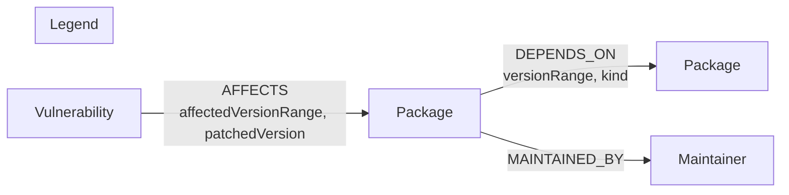

# DepScope

**A dependency & vulnerability exposure explorer, backed by [CognoDB](https://console.cognodb.com).**

Given a package, DepScope tells you every vulnerability it's exposed to —
directly, or through anything it depends on, at any depth — and shows you
the exact chain that gets you there. Given a vulnerability, it tells you
every package downstream that's exposed to it.

## Why a graph database?

A dependency tree isn't a tree — it's a graph. `express` and `mocha` both
depend on `debug`; `chokidar` is reachable from both `nodemon` and (via
`glob`) other tools. The moment you ask *"what's downstream of a vulnerable
package, at any depth?"*, you're asking a graph question: variable-length
reachability with path reconstruction.

In a relational schema, dependencies live in a `depends_on(from_id, to_id)`
join table. Answering "everything reachable within N hops" means either:

- chaining N self-joins, where N has to be decided ahead of time and the
  query changes shape depending on how deep you want to go, or
- a recursive CTE, which works but needs manual cycle protection, doesn't
  return the traversed path without extra bookkeeping columns, and gets
  markedly slower as fan-out grows because the engine is re-materializing
  intermediate result sets at every recursion level.

In CognoDB, the same question is one pattern:

```cypher
MATCH path = (exposed:Package)-[:DEPENDS_ON*1..5]->(affected:Package)
```

The database walks the relationship, the path comes back for free, and the
query plan doesn't change shape as the hop count changes — just the `*1..5`.
The full multi-hop query is in [`cypher/queries.md`](cypher/queries.md#1-transitive-vulnerability-exposure-the-headline-multi-hop-query).

Package registries also aren't table-shaped in a second way: a package can
have an arbitrary number of dependencies, dependents, and maintainers, and
the *interesting* queries ("shortest path between two packages," "who's
exposed," "which packages are single points of failure with the most
dependents") are all about the shape of the connections, not about
aggregating rows. That's the case for a graph database over a relational one
here.

---

## Data model



**Nodes**

| Label | Properties |
|---|---|
| `Package` | `name` *(unique)*, `ecosystem`, `description`, `latestVersion` |
| `Vulnerability` | `id` *(unique)*, `severity`, `cvssScore`, `summary`, `publishedAt` |
| `Maintainer` | `username` *(unique)*, `name` |

**Relationships**

| Type | Direction | Properties | Meaning |
|---|---|---|---|
| `DEPENDS_ON` | `Package → Package` | `versionRange`, `kind` (`direct`/`dev`) | A declares a dependency on B |
| `AFFECTS` | `Vulnerability → Package` | `affectedVersionRange`, `patchedVersion` | A vulnerability directly affects a package |
| `MAINTAINED_BY` | `Package → Maintainer` | — | Who maintains the package |

Dependencies are modeled at the **package** level (not per-version) to keep
the demo graph legible — see [Scope & simplifications](#scope--simplifications).

---

## Seed data

[`data/seed-data.json`](data/seed-data.json) contains ~52 real, well-known
npm packages (`express` and its actual dependency tree, `mocha`, `chokidar`,
`chalk`, `puppeteer`'s proxy-agent chain, etc.) wired together the way they
really depend on each other, plus 8 vulnerabilities modeled on real,
well-known classes of npm supply-chain issues (prototype pollution in
argument parsers, ReDoS in glob/brace-expansion libraries, an SSRF via IP
parsing, a path-traversal in a static file server). Vulnerability IDs are
synthetic (`DEP-YYYY-NNNN`) rather than real CVE identifiers, so the dataset
can be freely used and re-seeded without asserting anything about the real
CVE record.

This gives real multi-hop stories to click through, e.g.:

- `puppeteer` → `socks-proxy-agent` → `socks` → `ip` (3 hops to an SSRF)
- `nodemon` → `chokidar` → `braces` (2 hops to a ReDoS)
- `mocha` → `strip-ansi` → `ansi-regex` (2 hops to a ReDoS)

---

## Setup & run

### 1. Create your CognoDB instance

1. Sign up at [console.cognodb.com](https://console.cognodb.com/signup) (free, no card).
2. Create a free **c0** instance and pick a region — provisions in under a minute.
3. Copy the connection URI (`bolt+s://<instance-id>.databases.cognodb.cloud`)
   and the generated password for user `cognodb` — **the password is shown
   exactly once.**

### 2. Configure environment variables

```bash
cp .env.example .env.local
# then fill in COGNODB_URI / COGNODB_USER / COGNODB_PASSWORD
```

### 3. Install & seed

```bash
npm install
npm run seed      # loads data/seed-data.json into your CognoDB instance
```

`scripts/seed.ts` creates uniqueness constraints, then loads nodes and
relationships via parameterized, batched (`UNWIND`) Cypher — safe to re-run.

### 4. Run the app

```bash
npm run dev        # http://localhost:3000
```

### 5. Deploy (optional but part of the deliverable)

Push to GitHub, import the repo on [Vercel](https://vercel.com), and add the
three `COGNODB_*` environment variables in the project settings. No other
config needed — `next.config.js` already keeps `neo4j-driver` server-side.

---

## Requirements checklist

- [x] Labeled nodes, typed relationships, documented model + diagram (above)
- [x] Real/realistic seed data, loaded by an included script (`scripts/seed.ts`)
- [x] Multi-hop traversal (`*1..5` variable-length pattern — see `cypher/queries.md`)
- [x] A query awkward in SQL (unbounded-depth transitive reachability with path reconstruction)
- [x] Parameterized queries via the official Neo4j driver only (`lib/queries.ts` — no string concatenation)
- [x] Functional web app usable by a non-technical person
- [x] Loading, empty, and error states throughout (`components/States.tsx`)
- [x] Connection details from environment variables, never committed (`.env.example` + `.gitignore`)
- [x] Graceful handling when the database is unreachable (`lib/db.ts` → `DbConnectionError`, surfaced as a friendly banner, not a stack trace)

---

## Project structure

```
app/
  page.tsx                       dashboard — search, package list, vulnerability list
  packages/[name]/page.tsx       package detail + transitive exposure
  vulnerabilities/[id]/page.tsx  vulnerability detail + transitive exposure
  api/                           REST endpoints, each backed by lib/queries.ts
lib/
  db.ts                          driver singleton + connectivity error handling
  queries.ts                     every Cypher query, parameterized
components/                      SeverityBadge, States (loading/empty/error), PathTrace
cypher/
  schema.cypher                  constraints
  queries.md                     documented main queries
data/seed-data.json              seed dataset
scripts/seed.ts                  idempotent loader
```

---

## Scope & simplifications

This is a demo-scale dataset (~52 packages, ~60 edges), well within the
free-tier limits (a few thousand to a few hundred thousand nodes/edges).
Two deliberate simplifications, called out for transparency:

- **Dependencies are package-level, not version-level.** A real registry
  resolves version ranges against a lockfile; here `DEPENDS_ON` connects
  packages directly with a descriptive `versionRange` string, and
  `AFFECTS`/`Vulnerability` carries the actual affected/patched range. This
  keeps the graph legible for a take-home while still supporting the core
  question ("is the version we depend on inside the affected range?").
- **Seed data is illustrative, not a live registry snapshot.** Package
  metadata and version numbers are realistic but were assembled by hand
  rather than pulled from the npm registry API at seed time.
